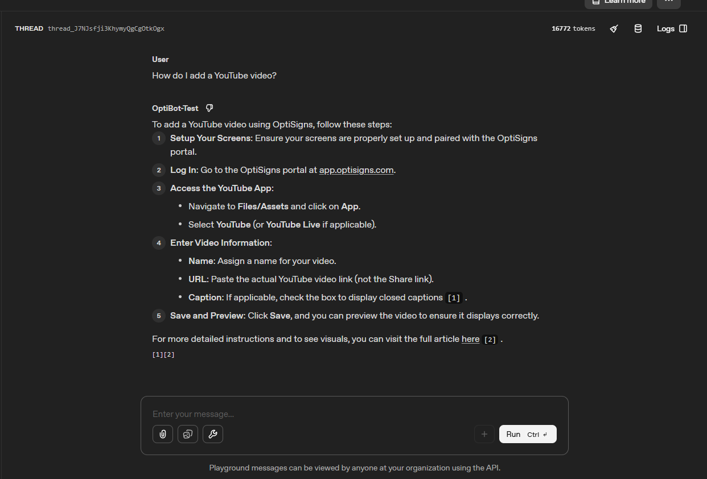
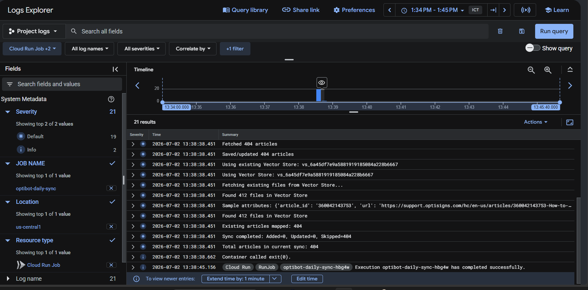

# Helpdesk RAG Sync

This project scrapes articles, converts them to Markdown, and syncs them into an OpenAI Vector Store for retrieval by an assistant.
The current sync covers **404 scraped articles**.

## Setup

1. Copy the sample environment file:
   ```bash
   cp .env.sample .env
   ```
2. Fill in the required variables:
   - `OPENAI_API_KEY`
   - `VECTOR_STORE_ID` (optional on first run; the script will create one if missing)

## Run locally

```bash
pip install -r requirements.txt
python main.py
```

You can also run the same job in Docker:

```bash
docker build -t kb-sync-pipeline .
docker run --rm -e OPENAI_API_KEY=your-key -e VECTOR_STORE_ID=your-store optibot-job
```

## Chunking strategy

The sync uses static chunking with:
- `max_chunk_size_tokens: 800`
- `chunk_overlap_tokens: 400`

This is a good fit for support articles because it preserves context around numbered steps and troubleshooting instructions while keeping chunks compact.

## Assistant sanity check

After the first sync completes, create an assistant in the OpenAI Playground and attach the vector store. Then test it with:

```text
How do I add a YouTube video?
```

### Result:


## Daily job / deployment

The container is designed to run once and exit successfully. This project is deployed on Google Cloud Run Jobs triggered by Cloud Scheduler on a daily schedule (02:00 UTC).

- Docker image stored in Artifact Registry
- Job: kb-sync-daily
- Region: us-central1
- Environment variables are set directly on the job

### Logs in the Google Cloud Console:



## Notes

The Assistants API (used to create and query the assistant) is scheduled for
sunset on **August 26, 2026**. The Vector Store and file upload APIs used by
this project are unaffected — they are shared infrastructure between the
Assistants API and its replacement, the Responses API. When the time comes,
the migration path is to swap the Assistant query layer for a Responses API
call with the `file_search` tool pointed at the same `VECTOR_STORE_ID`, with
no re-ingestion needed.